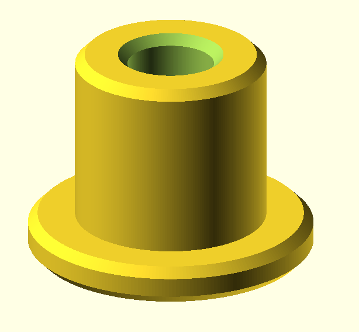

# Shaper Origin Shelf

SVGs, Affinity files, and 3D-printed benchdogs for a small Shaper Origin shelf project.  

## Outline

The shelf measures 420x300 mm and contains 20 mm holes compatible with the Festool MFT. OpenSCAD drawings are available for the "stoppers". This makes it possible to scan once and use your workspace over and over, no need to scan again.

### The Shelf

Nothing really special. It is a 420x300 mm MDF with hole pattern matching the Festool MFT-3.

### The Stopper

Place the stopper along the rim of the board to create your coordinate system.

### The Underdog

The underdog has a nut insert that lets you use the original Shaper Origin clamps.

